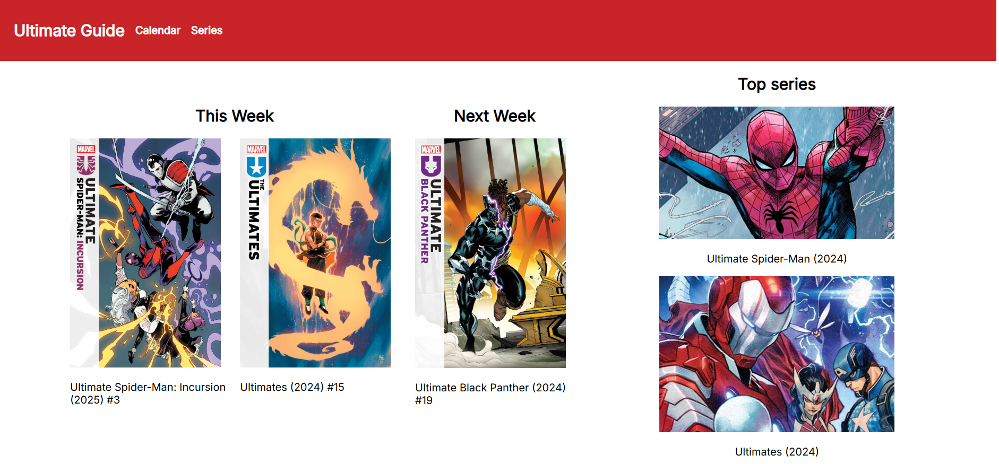
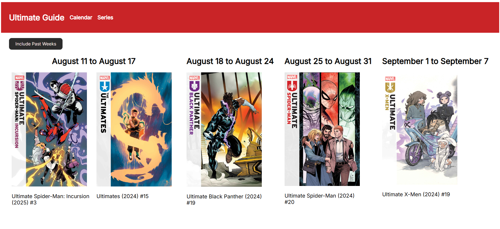
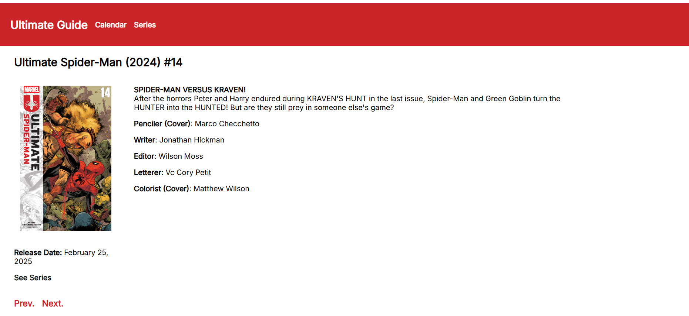

# UltimateGuide

Data provided by Marvel. Powered by Marvel API.

A page to visualize future and past comic releases of the New Ultimate Universe Imprint

## Table of Contents

- [Features](#Features)
- [Installation](#Installation)
- [Usage](#Usage)
- [Acknowledgements](#Acknowledgements)

## Features

- View weekly release calendar for Ultimate Universe titles
- Browse series and issue details

## Installation

Clone the repo and set up both frontend and backend.

### Prerequisites

- **Node.js**: Required for the frontend.
  - [Download & Install Node.js](https://nodejs.org/en/download/)

* **Python 3.9+**: Required for the backend.

- **MongoDB Community Edition**: Required for the backend database.
  - [Install MongoDB](https://www.mongodb.com/docs/manual/administration/install-community/)

### MongoDB (Local)

You must have a database named "Ultimate" with collections:

- issues
- series
- weeks

on cmd

```
mongod
```

### Backend

set up a venv python on /ultimate-backend

```
cd ultimate-backend
python -m venv ./Venv
source Venv/Scripts/activate
pip install -r requirements.txt
deactivate
```

then you can run the backend anytime with this simple command

```
cd ultimate-backend
./start.sh
```

### Frontend

```
cd ultimate-frontend
npm install
npm run dev
```

## Usage

Visit http://localhost:5173 to use the app locally.

On /docs you may see the Fastapi documentation

## Acknowledgements

- Comic data powered by the [Marvel API](https://developer.marvel.com/)

## Screenshots

### Home



### Calendar



### Issue


